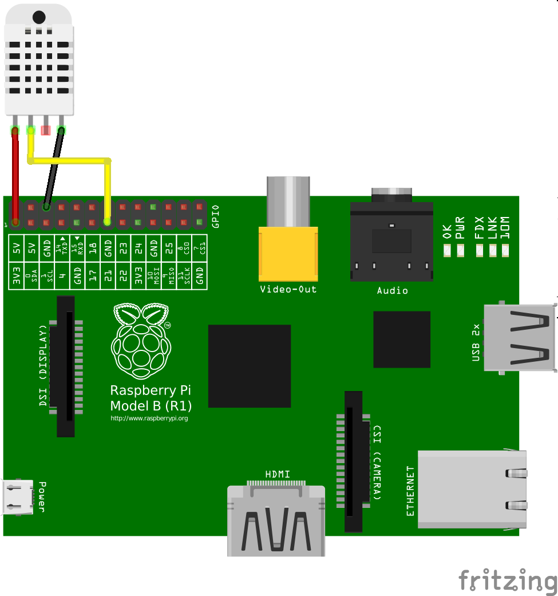

RPi.DHT
#######

Python implementation for Adafruit_DHT sensor for Raspberry Pi.

RPi.DHT is using DHT sensor with Raspberry Pi GPIO.

To connect to Raspberry Pi plug DHT sensor data into GPIO PIN 21 and GROUD and POWER PINs. Install and execute RPi.DHT
and it should work. Alternatively you can user different PIN and execute raspi-dht with parameter:
``raspi-dht --pin pin_number``.

RPi.DHT supports number of parameters and also configuration file. For more details see ``raspi-dht --help`` or sample
config.

Sensor is based on `RPi.Sensor <https://github.com/ricco386/RPi.Sensor/>`_ library, which make base for implementing
different types of sensors in Python.

Installation
------------

There is an `Ansible role at galaxy <https://galaxy.ansible.com/ricco386/rpi-dht-ansible/>`_, which will do all the
dependencies, config creation, and creates systemd service. Otherwise follow install instructions below:

Pre-Installation requirements
=============================

- Update system and install required dependencies::

    sudo apt-get update

RPi.DHT needs `Adafruit Python DHT Sensor Library <https://github.com/adafruit/Adafruit_Python_DHT>`_. Make sure your
system is able to compile Python extensions. On Raspbian or Debian/Ubuntu image you can ensure your system is ready by
executing::

    sudo apt-get install build-essential python3-dev python3-pip

RPi.DHT Installation
====================

- Install Adafruit_Python_DHT using pip (Unfortunately this library is deprecated, but I wasnt able to find better
alternative in Python)::

    pip install https://github.com/adafruit/Adafruit_Python_DHT/tarball/master

- Install RPi.DHT using pip (RPi.Sensor dependency will be installed automatically)::

    pip install https://github.com/ricco386/RPi.DHT/tarball/master/

- Alternatively install latest released version from pypi::

    pip install --upgrade RPi.DHT

Run RPi.DHT as a systemd service
================================

- Make sure all dependencies (listed below) are installed (done automatically when installing via pip)
- The ``raspi-dht`` command should be installed somewhere in your ``PATH`` (done automatically when installing via pip),
make sure `raspi-dht.service` has corect path in `ExecStart` set to `raspi-dht` executable.
- Systemd scripts are available: https://github.com/ricco386/RPi.DHT/tree/master/init.d to install them you will need
root privileges, so we execute them as sudo::

    sudo cp init.d/raspi-dht.conf /etc/tmpfiles.d/
    sudo cp init.d/raspi-dht.service /etc/systemd/system/
    sudo systemd-tmpfiles --create /etc/tmpfiles.d/raspi-dht.conf
    sudo systemctl enable raspi-dht.service  # Enable service to start at system boot
    sudo systemctl start raspi-dht.service  # Start

Systemd scripts should be run under **default Raspberry Pi user** (pi), scripts have to be able access GPIO.

**Dependencies:**

- `Adafruit_DHT <https://github.com/adafruit/Adafruit_Python_DHT>`_
- `RPi.Sensor <https://github.com/ricco386/RPi.Sensor>`_ (0.5.3+)

License
-------

For more information see the `LICENSE <https://github.com/ricco386/RPi.DHT/blob/master/LICENSE>`_ file.
